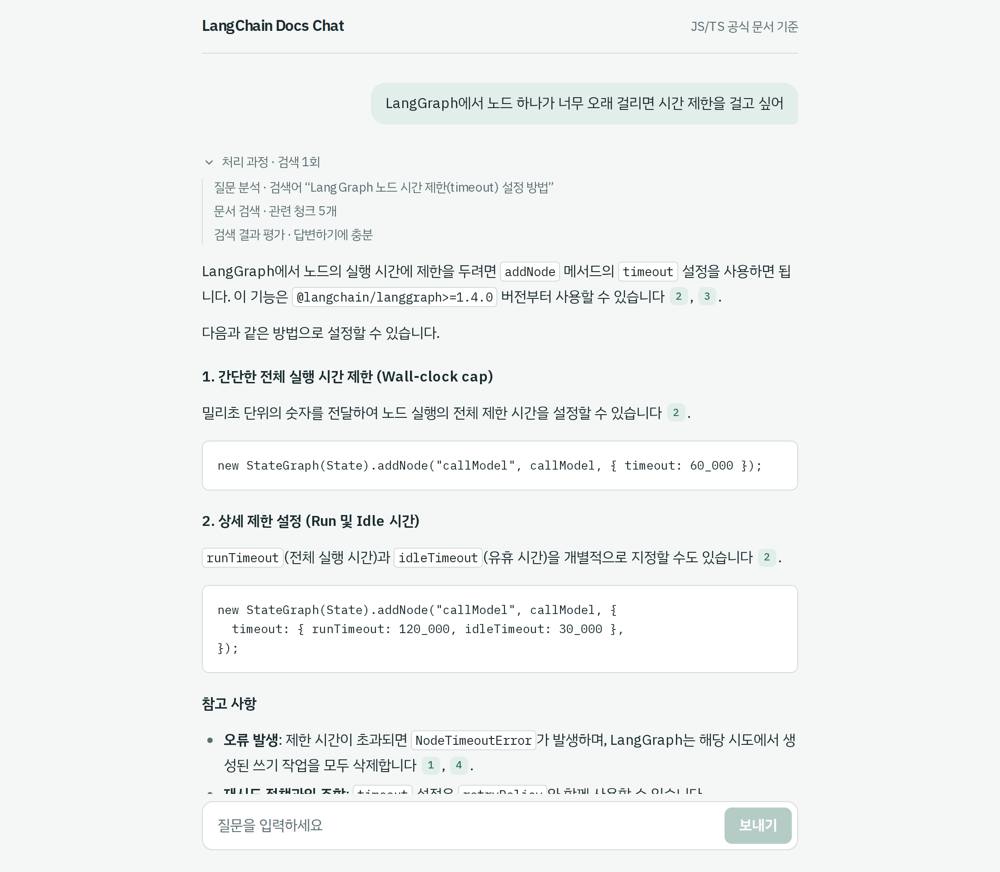
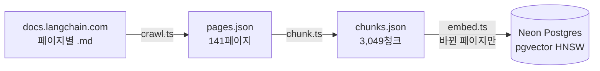
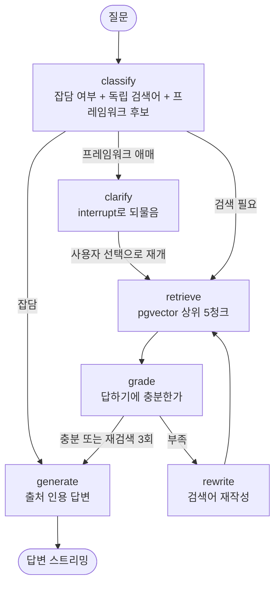

# pgvector-docs-chat

LangChain 공식 문서(JS/TS)를 근거로 답하는 RAG 챗봇입니다. LangGraph로 질문 분석 → 검색 → 검색 결과 평가 → 재검색 → 답변 흐름을 만들고, 답변마다 참고한 문서를 번호로 인용합니다.

**데모**: https://<배포-URL>



## 주요 기능

- **근거 기반 답변**: 검색한 문서 안에서만 답하고, 근거로 쓴 문서를 `[n]`으로 인용합니다. 문서에 없으면 찾지 못했다고 답합니다.
- **자기 교정 검색 (Self-RAG)**: 검색 결과가 답하기에 부족하면 검색어를 문서 용어로 다시 써서 최대 3번까지 재검색합니다.
- **후속 질문 이해**: "그거 예시는?" 같은 질문을 대화 맥락을 반영한 독립 질문으로 바꿔 검색합니다.
- **애매한 질문 되묻기**: "메모리는 어떻게 써?"처럼 LangChain·LangGraph·Deep Agents 중 어느 것인지 알 수 없으면 그래프를 멈추고 선택지를 보여준 뒤, 고른 프레임워크 문서에서만 찾습니다.
- **대화 저장과 분기**: 대화가 서버에 저장돼 새로고침하거나 링크(`?thread=`)를 공유해도 이어집니다. 이전 질문을 고치면 그 시점부터 대화가 갈라지고, `‹ 1/2 ›`로 분기를 오갈 수 있습니다.
- **처리 과정 표시**: 그래프의 각 단계(검색어, 찾은 청크 수, 평가 결과)를 실시간으로 보여주고, 답변이 시작되면 접어 둡니다.
- **장애 대응**: 모델 실패 시 다른 모델로 자동 전환하고, 응답이 없으면 시간 제한 후 재시도 버튼을 보여줍니다.

## 아키텍처

### 데이터 파이프라인 (`scripts/`)



- **청킹**: MDX 태그를 정리한 뒤 헤딩 단위로 섹션을 나누고, 1500자 / 150자 overlap으로 분할합니다. 각 청크 앞에 `제목 > 섹션 > 하위 섹션` 경로를 붙여, 짧은 청크도 어느 문서의 어떤 내용인지 임베딩에 드러나게 했습니다.
- **임베딩**: `gemini-embedding-001` 1536차원 ([ADR-001](docs/adr/ADR-001-embedding-model.md))
- **증분 동기화**: DB에 저장된 청크 본문과 비교해 바뀐 페이지만 다시 임베딩합니다. 무료 티어 일일 한도(약 1,000건) 안에서 여러 날에 나눠 이어서 실행할 수 있습니다 ([ADR-002](docs/adr/ADR-002-incremental-sync.md)).

### 질문 처리 (LangGraph, `apps/web/src/lib/graph`)



- `POST /api/chat`은 NDJSON 이벤트 스트림으로 응답합니다: 단계 진행(`step`), 답변 토큰(`token`), 출처(`sources`), 실패(`error`).
- LLM 호출 횟수를 줄이려고 분류와 검색어 작성을 한 번에 처리하고, 검색 결과는 청크별이 아니라 묶어서 한 번에 평가합니다.

### 애매한 질문 되묻기 (`interrupt`)

- 같은 주제(메모리, 스트리밍, human-in-the-loop, 서브에이전트 등)가 세 프레임워크 문서에 따로 있어, 어느 것인지 모르고 검색하면 섞인 답이 나옵니다.
- classify가 질문과 앞선 대화에 프레임워크 단서가 없을 때만 후보를 내고, 2개 이상이면 `clarify` 노드가 `interrupt()`로 그래프를 멈춥니다. 선택지는 체크포인트에 남아 새로고침해도 다시 보이고, 고르면 `Command({ resume })`로 이어서 실행합니다.
- 고른 프레임워크로 pgvector 검색 범위를 `source_url` 경로로 제한합니다. HNSW는 후보를 먼저 고른 뒤 거르므로 필터 검색에서만 iterative scan(pgvector 0.8)을 켜 결과가 모자라지 않게 했습니다.
- 필터는 사용자가 직접 고른 경우에만 겁니다. classify의 추측으로 거르면 잘못 분류됐을 때 정답 문서가 빠집니다.

### 대화 저장과 분기 (`PostgresSaver`, time travel)

- 그래프를 `PostgresSaver` checkpointer로 컴파일해, 대화 상태가 노드 실행마다 Neon의 `langgraph` 스키마에 `thread_id`별로 저장됩니다. 클라이언트는 대화 기록 대신 `threadId`와 새 질문만 보냅니다.
- 질문 수정·재시도는 그 질문이 들어가기 직전 체크포인트에서 다시 실행(fork)해 형제 분기를 만듭니다. `GET /api/threads/[id]`가 `getStateHistory`로 체크포인트 트리를 읽어 지금 보이는 분기의 대화와 질문별 분기 목록을 돌려줍니다 ([`threads.ts`](apps/web/src/lib/threads.ts)).
- 답변 없이 실패한 실행은 재시도로 대체된 것이므로 분기 목록에서 숨깁니다.
- 체크포인트 전용 DB 계정은 자기 스키마만 쓸 수 있고 문서 테이블에는 접근할 수 없습니다 ([schema.md](docs/schema.md#대화-체크포인트-langgraph-스키마)).

## 검색 품질 평가

검색이 실제로 잘 되는지 확인하려고 평가셋을 만들어 측정했습니다 (`pnpm --filter scripts eval`).

- **평가셋** ([`scripts/eval/questions.json`](scripts/eval/questions.json)): 50문항. 한국어 36 / 영어 14, 유형은 API 이름 없이 상황만 설명하는 질문 31, API 이름 질문 12, 에러 메시지 질문 7
- **정답 기준**: 페이지가 아니라 **섹션 단위**. 같은 페이지의 다른 섹션이 나오면 틀린 것으로 봅니다.
- **지표**: Hit@k(상위 k개 청크에 정답 섹션이 있는 질문 비율), MRR(첫 정답 순위의 역수 평균). 챗봇은 상위 5개 청크를 답변 근거로 쓰므로 Hit@5가 핵심 지표입니다.

| | 문항 | Hit@1 | Hit@3 | Hit@5 | MRR |
|---|---:|---:|---:|---:|---:|
| 전체 | 50 | 78% | 94% | **98%** | 0.858 |
| 한국어 | 36 | 78% | 97% | 100% | 0.868 |
| 영어 | 14 | 79% | 86% | 93% | 0.832 |
| 상황 설명 | 31 | 74% | 94% | 100% | 0.844 |
| API 이름 | 12 | 92% | 100% | 100% | 0.944 |
| 에러 메시지 | 7 | 71% | 86% | 86% | 0.771 |

**결론과 판단**

- 한국어 질문으로 영어 문서를 검색해도 Hit@5 100%로, 벡터 검색만으로 충분했습니다.
- 상위 5개 밖으로 밀린 질문은 문서 전체에서 청크 하나에만 나오는 에러 이름(`ContextOverflowError`) 1건입니다. 드문 식별자에 약하다는 벡터 검색의 알려진 약점이 그대로 드러났습니다.
- 키워드 검색을 섞는 하이브리드 검색을 검토했지만, 개선 여지가 1문항뿐이라 지금은 도입하지 않았습니다. 병목은 검색보다 답변 생성 쪽에 있다고 보고 있습니다.

**한계**: 질문과 정답을 개발 과정에서 직접 작성해 편향이 있을 수 있습니다. 처음 측정 후 놓친 질문을 검토하다 정답을 좁게 잡은 2문항을 발견해 정답 섹션을 추가했습니다(Hit@5 94% → 98%).

### 되묻기 판단 평가

되물어야 할 때만 묻는지 확인하려고 classify만 따로 실행해 측정했습니다 (`pnpm --filter scripts eval-clarify`, [`clarify-questions.json`](scripts/eval/clarify-questions.json)).

- **평가셋**: 23개. 어느 프레임워크인지 알 수 없는 질문 10 (예: "메모리는 어떻게 써?"), 프레임워크·API 이름·비교·에러 메시지로 알 수 있는 질문 10, 앞선 대화에서 프레임워크를 밝힌 후속 질문 3
- **지표**: recall은 되물어야 할 질문 중 실제로 되물은 비율, precision은 되물은 질문 중 되물어야 했던 비율. 불필요하게 되물으면 사용자를 귀찮게 하므로 precision을 우선해 프롬프트에 "확실하지 않으면 묻지 않는다"를 넣었습니다.

| 모델 | 정확도 | recall | precision |
|---|---:|---:|---:|
| `gemini-3.5-flash-lite` | 20/23 | 7/10 | **7/7** |
| `qwen2.5:7b` (Ollama, 로컬 개발용) | 14/23 | 1/10 | 1/1 |

- 두 모델 모두 불필요하게 되물은 경우는 없었고, 앞선 대화로 프레임워크를 알 수 있는 후속 질문 3개도 되묻지 않았습니다.
- `gemini-3.5-flash-lite`가 놓친 3개는 구조화 출력, React 스트리밍, 도구 실행 전 승인처럼 주제가 비교적 좁은 질문이었습니다. 놓쳐도 지금처럼 전체 문서에서 검색해 답하므로 이전보다 나빠지지는 않습니다.
- 작은 로컬 모델은 거의 되묻지 않아, 이 기능은 Gemini에서만 의미가 있습니다. 기본 모델(`gemini-3.8-flash`)은 측정 당일 무료 한도가 소진돼 측정하지 못했습니다.

## 운영 이슈와 대응

모두 무료 티어로 운영하면서 겪은 문제입니다.

| 문제 | 대응 |
|---|---|
| 임베딩 일일 한도(약 1,000건)로 3천 청크를 하루에 못 넣음 | 바뀐 페이지만 임베딩하는 증분 동기화로 4일에 나눠 적재 ([ADR-002](docs/adr/ADR-002-incremental-sync.md)) |
| `gemini-3.8-flash` 무료 티어가 하루 20요청이라 질문 몇 개면 429 | `gemini-3.5-flash` → `gemini-3.1-flash-lite` 순으로 자동 전환 ([`llm.ts`](apps/web/src/lib/llm.ts)) |
| 모델이 에러 없이 응답을 멈춰 화면이 계속 대기 | 호출마다 시간 제한(15초/30초)을 둬 다음 모델로 전환, 실패한 모델은 1분간 건너뜀. 그래프 전체도 50초 제한 |
| 질문을 수정해 분기하면 새 분기가 다른 분기의 메시지를 읽음 | JS `PostgresSaver`가 채널 버전을 정수로 1씩 올려 두 분기의 버전이 겹치고, `checkpoint_blobs`의 `ON CONFLICT DO NOTHING`으로 새 값이 버려지는 문제를 체크포인트 덤프로 확인. Python 구현처럼 버전에 난수 접미사를 붙이도록 `getNextVersion`을 재정의 ([`checkpointer.ts`](apps/web/src/lib/db/checkpointer.ts)) |
| 스트리밍 도중 실패하면 HTTP 상태 코드로 알릴 수 없음 | `error` 이벤트로 원인별 안내(한도 초과 / 시간 초과 / 기타), 마지막 답변에 재시도 버튼 |

## 기술 스택

- **앱**: Next.js 14 (App Router), React, Tailwind CSS
- **AI**: LangGraph, LangChain, Gemini (LLM: 3.8 / 3.5 Flash, 임베딩: `gemini-embedding-001`), 로컬 개발 시 Ollama
- **DB**: PostgreSQL + pgvector (Neon), HNSW 인덱스, 코사인 거리
- **배포**: Vercel
- **모노레포**: pnpm workspace (`apps/web`, `scripts`)

## 프로젝트 구조

```
apps/web/src/
├── app/
│   ├── page.tsx              # 채팅 UI (스트림 파싱, 처리 과정, 재시도, 질문 수정·분기 전환)
│   ├── api/chat/route.ts     # 그래프 실행 → NDJSON 이벤트 스트림
│   └── api/threads/[id]/route.ts  # 저장된 대화 불러오기
├── components/AnswerMarkdown.tsx  # 마크다운 + [n] 인용 배지
└── lib/
    ├── graph/                # LangGraph 상태·노드·그래프 정의
    ├── db/pgvector.ts        # 유사도 검색 (읽기 전용 계정)
    ├── db/checkpointer.ts    # 대화 체크포인트 저장 (PostgresSaver)
    ├── threads.ts            # 체크포인트 트리 → 화면용 대화·분기 목록
    ├── embedding.ts          # Gemini 임베딩 (저장·검색 공용)
    └── llm.ts                # LLM 호출, 모델 자동 전환
scripts/
├── crawl.ts / chunk.ts / embed.ts  # 데이터 파이프라인
├── eval.ts, eval/questions.json    # 검색 품질 평가
├── eval-clarify.ts, eval/clarify-questions.json  # 되묻기 판단 평가
└── setup-checkpointer.ts / cleanup-threads.ts  # 체크포인트 테이블 생성, 오래된 대화 정리
docs/
├── schema.md                 # DB 스키마
└── adr/                      # 설계 결정 기록
```

## 로컬 실행

**준비물**: Node.js 24, pnpm, Gemini API 키, pgvector를 쓸 수 있는 Postgres(Neon 등)

```bash
pnpm install
cp apps/web/.env.example apps/web/.env.local   # 값 채우기
```

DB에 [`docs/schema.md`](docs/schema.md)의 테이블과 인덱스를 만들고, 계정 3개(임베딩 저장용, 챗봇 검색용 읽기 전용, 대화 체크포인트용)를 준비합니다. 체크포인트 테이블은 schema.md의 절차대로 `pnpm --filter scripts setup-checkpointer`로 만듭니다.

```bash
# 데이터 적재 (data/ 아래에 중간 결과 저장)
pnpm --filter scripts crawl
pnpm --filter scripts chunk
pnpm --filter scripts embed    # 무료 한도에 걸리면 멈춤. 다음 날 다시 실행하면 이어서 진행

# 검색 품질 평가
pnpm --filter scripts eval

# 되묻기 판단 평가 (질문마다 LLM 1회, Gemini는 분당 한도 때문에 13초 간격)
pnpm --filter scripts eval-clarify

# 30일 넘게 활동이 없는 대화 정리 (기본은 대상만 출력)
pnpm --filter scripts cleanup-threads -- --delete

# 챗봇 실행 (http://localhost:3000)
pnpm dev
```

> Windows와 WSL을 오가며 쓴다면 `pnpm install`은 Windows에서 하세요. 두 OS의 네이티브 바이너리를 함께 받도록 설정돼 있지만(`pnpm-workspace.yaml`), WSL이 만든 심볼릭 링크는 Windows에서 읽지 못합니다. WSL의 개발 서버는 `/mnt/` 아래 파일 변경을 감지하지 못하므로 코드를 고친 뒤 다시 시작해야 합니다.

### 환경 변수 (`apps/web/.env.local`)

| 변수 | 설명 |
|---|---|
| `LLM_PROVIDER` | `gemini`(기본) 또는 `ollama`. 임베딩은 항상 Gemini |
| `GEMINI_API_KEY` | Gemini API 키 |
| `GEMINI_MODEL` | 첫 번째로 시도할 LLM (기본 `gemini-3.8-flash`). 실패하면 자동 전환 |
| `OLLAMA_BASE_URL`, `OLLAMA_MODEL` | `LLM_PROVIDER=ollama`일 때만 사용 |
| `EMBED_DATABASE_URL` | 쓰기 계정. `scripts/embed.ts`에서만 사용 |
| `DATABASE_URL` | 읽기 전용 계정. 챗봇 검색과 평가에서 사용 |
| `CHECKPOINT_DATABASE_URL` | 대화 체크포인트 계정. `langgraph` 스키마만 쓰기 가능 |

## 문서

- [DB 스키마](docs/schema.md)
- [ADR-001: 임베딩 모델과 차원](docs/adr/ADR-001-embedding-model.md)
- [ADR-002: 증분 동기화](docs/adr/ADR-002-incremental-sync.md)
- [개발 계획과 진행 상황](plan.md)
